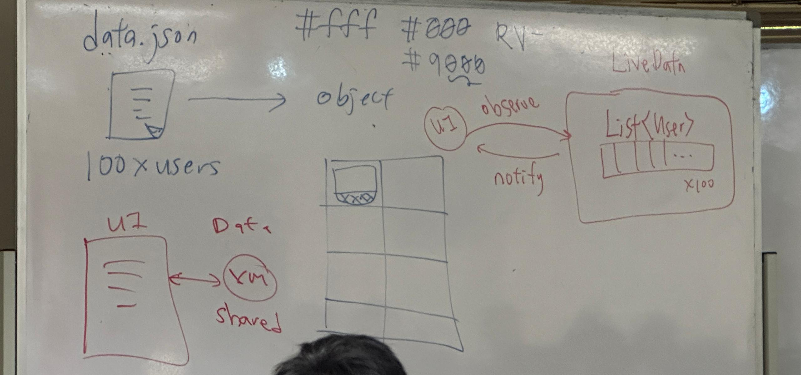

# Demo


# Instruction
1. Add in Additional plugins on `build.gradle.kts`
    
    ```kotlin
    plugins {
        id("com.android.application")
        id("org.jetbrains.kotlin.android")
    
        // TODO: Additional plugins
        id("org.jetbrains.kotlin.plugin.serialization") version "1.9.0"
    }
    
    android {
        namespace = "com.example.demo"
        compileSdk = 33
    
        defaultConfig {
            applicationId = "com.example.demo"
            minSdk = 24
            targetSdk = 33
            versionCode = 1
            versionName = "1.0"
        }
    
        buildTypes {
            release {
                isMinifyEnabled = false
                proguardFiles(
                    getDefaultProguardFile("proguard-android-optimize.txt"),
                    "proguard-rules.pro"
                )
            }
        }
        compileOptions {
            sourceCompatibility = JavaVersion.VERSION_1_8
            targetCompatibility = JavaVersion.VERSION_1_8
        }
        kotlinOptions {
            jvmTarget = "1.8"
        }
        buildFeatures {
            viewBinding = true
        }
    }
    
    dependencies {
        implementation("androidx.core:core-ktx:1.10.1")
        implementation("androidx.appcompat:appcompat:1.6.1")
        implementation("com.google.android.material:material:1.9.0")
        implementation("androidx.constraintlayout:constraintlayout:2.1.4")
        implementation("androidx.navigation:navigation-fragment-ktx:2.5.0")
        implementation("androidx.navigation:navigation-ui-ktx:2.5.0")
    
        // TODO: Additional libraries
        implementation("org.jetbrains.kotlinx:kotlinx-serialization-json:1.6.0")
        implementation("io.coil-kt:coil:2.1.0")
    }
    ```
    
    <aside>
    💡 kotlinx stand for kotlin extra (extra functionality that kotlin does not provide 
    </aside>
    <br />
    <aside>
    💡 coil is use for load the internet image   
    </aside>
    
2. Create Folder > Raw Resources folder
3. Drag `data.json` to raw folder (+ Ctrl so it become from moving to copying)
4. Go to `item_photo.xml`, select `imgPhoto`, To make the image fill with the `ContrainstLayout`, `layout_width` and `layout_height` = 0dp match constraints, and Add ratio1:1 by click the top left corner
5. Click `txtName` , Go to background , you see the #9000, 9 stand for `transparency`
6. Then just follow what we include in the github

# Extra Information



